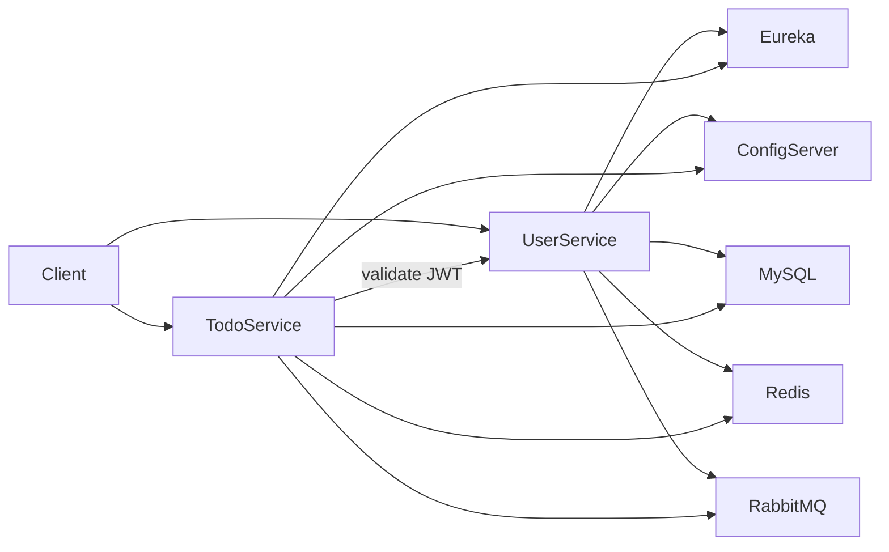

# TodoApp

A Spring Boot microservices todo application with JWT authentication, service discovery, centralized configuration, and supporting infrastructure (MySQL, Redis, RabbitMQ).

## Architecture



| Module | Port | Role |
|--------|------|------|
| `service-registry` | 8761 | Eureka service discovery |
| `config-server` | 8888 | Spring Cloud Config (native backend → `config-repo/`) |
| `user-service` | 8083 | Registration, login, OTP verification, JWT issuance |
| `todo-service` | 8082 | Todo CRUD with JWT validation via user-service |

**Infrastructure** (Docker Compose): MySQL `3306`, Redis `6379`, RabbitMQ `5672` / management UI `15672`

## Tech stack

- Java 17, Maven, Spring Boot 3
- Spring Cloud (Eureka, Config Server)
- Spring Security + JWT
- MySQL, Redis, RabbitMQ
- springdoc-openapi (Swagger UI)

## Prerequisites

- [Java 17](https://adoptium.net/)
- [Maven 3.9+](https://maven.apache.org/)
- [Docker Desktop](https://www.docker.com/products/docker-desktop/) (for MySQL, Redis, RabbitMQ)

## Quick start

### 1. Configure secrets

```powershell
copy .env.example .env
```

Edit `.env` and set your own values. **Use the same `JWT_SECRET` for both `user-service` and `todo-service`.**

| Variable | Used by |
|----------|---------|
| `JWT_SECRET` | user-service, todo-service |
| `DB_USERNAME` / `DB_PASSWORD` | Spring services, Docker MySQL |
| `MYSQL_ROOT_PASSWORD` | Docker MySQL |
| `MAIL_USERNAME` / `MAIL_PASSWORD` | user-service (optional; mail disabled by default) |

### 2. Start infrastructure

```powershell
docker compose up -d
```

On first run, MySQL creates the `user_db` and `todo` databases and applies `todo.sql`.

To reset the database (destroys data):

```powershell
docker compose down -v
docker compose up -d
```

### 3. Start services (in order)

Start each module from its directory with environment variables loaded from `.env`:

```powershell
cd service-registry
mvn spring-boot:run
```

```powershell
cd config-server
mvn spring-boot:run
```

```powershell
cd user-service
mvn spring-boot:run
```

```powershell
cd todo-service
mvn spring-boot:run
```

On Windows PowerShell, load `.env` before starting a service:

```powershell
Get-Content ..\.env | ForEach-Object {
  if ($_ -match '^\s*([^#][^=]+)=(.*)$') { Set-Item -Path "env:$($matches[1].Trim())" -Value $matches[2].Trim() }
}
mvn spring-boot:run
```

Verify Eureka at http://localhost:8761 — both `user-service` and `todo-service` should appear.

### 4. Try the API

**Swagger UI**

- user-service: http://localhost:8083/swagger-ui.html
- todo-service: http://localhost:8082/swagger-ui.html

**Typical flow**

1. `POST /api/v1/auth/register` — create an account
2. `POST /api/v1/auth/activate/{email}?otp=...` — verify OTP (printed to console when `app.mail.enabled` is `false`)
3. `POST /api/v1/auth/login` — receive a JWT
4. On todo-service Swagger, click **Authorize** and paste `Bearer <token>`
5. Use the todo CRUD endpoints

## Configuration

Runtime config is centralized in `config-repo/` and served by the config server. Each service bootstraps with:

```yaml
spring.config.import: optional:configserver:http://localhost:8888
```

Secrets (`JWT_SECRET`, database credentials) are **not** committed. They are referenced as environment variables in `config-repo/user-service.yml` and `config-repo/todo-service.yml`.

## Running tests

```powershell
cd user-service
mvn test

cd todo-service
mvn test
```

Tests use an in-memory H2 database and do not require Docker.

## Project layout

```
TodoApp/
├── config-repo/          # Centralized Spring Cloud Config files
├── config-server/        # Config server (port 8888)
├── service-registry/     # Eureka server (port 8761)
├── user-service/         # Auth service (port 8083)
├── todo-service/         # Todo API (port 8082)
├── docker-compose.yml    # MySQL, Redis, RabbitMQ
├── todo.sql              # Todo schema (applied on first MySQL init)
└── .env.example          # Template for local secrets
```
